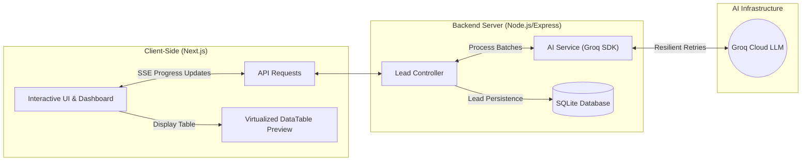
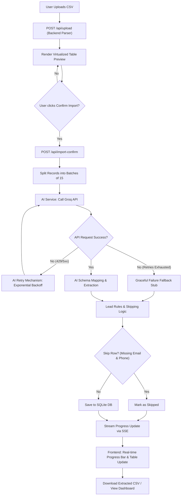

# Technical Architecture & Data Flow

This document details the architectural design, processing flow, and security configurations of the GrowEasy CRM AI Lead Importer.

---

## 🔄 Architecture & Data Flow

### 1. High-Level System Architecture
The application is structured into three primary layers: the Next.js Frontend Client, the Node.js/Express Backend Server (with SQLite database), and the External Groq Cloud LLM:

### 2. End-to-End Processing Flow
Below is the detailed step-by-step processing lifecycle of an uploaded CSV file:

---

## 🏗️ Architecture & Security Highlights

*   **Multi-Stage Build Pipeline:** 
    *   In the **Builder** stage, native libraries (`sqlite3`) are compiled directly from source, eliminating standard runtime GLIBC errors on Windows/Linux host transfers.
    *   In the **Runner** stage, we throw away all build tools, source code, and developer packages. Next.js runs in its specialized `standalone` bundle, reducing the final image size from 1.5GB to ~150MB.
*   **Running as Non-Root User:** Both frontend and backend runner stages drop root access privileges to run as a restricted `nextjs` system user, providing production-grade security.
*   **SQLite Volume Persistence:** The SQLite database is mounted as a named Docker volume (`sqlite_data`) mapped to `/app/data` inside the container. This guarantees your data persists even if you rebuild or stop the container.
