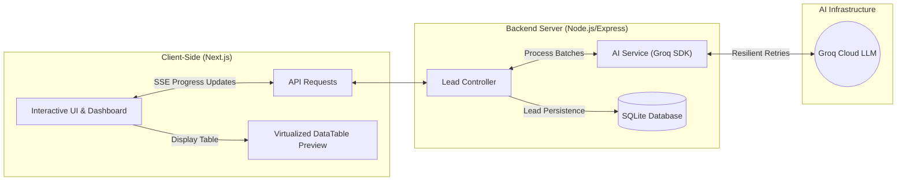
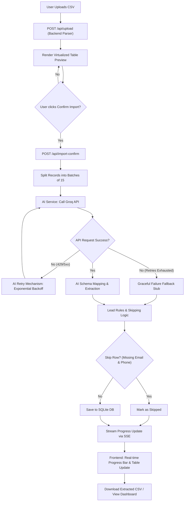

# GrowEasy CRM — AI-Powered CSV Lead Importer
### Developed by **Aritra Dhank**

> 🚀 **Live Demo:** [Deployed Application Link](https://grow-easy-assignment-three.vercel.app)

GrowEasy CRM AI Lead Importer is a robust full-stack web application designed to clean, map, and import messy CSV datasets (e.g., Facebook Lead Exports, Google Ads Exports, arbitrary CRM sheets) into a unified GrowEasy CRM schema using the high-performance **Groq LLM AI Engine**.

---

## 🌟 Key Features

### 1. Functional Requirements (Fully Implemented)

#### 💻 Frontend (Next.js)
*   **Step 1 — Upload CSV:** Supports both traditional file picking and drag-and-drop uploads.
*   **Step 2 — Pre-AI Preview Table:** Renders the uploaded CSV raw contents in a beautiful, responsive table featuring sticky headers, horizontal scrolling, and vertical scrolling—without initiating premature AI API calls.
*   **Step 3 — Confirm Import Step:** A prominent "Confirm Import" button ensures the backend AI mapping service is called only after the user's explicit confirmation.
*   **Step 4 — Display Parsed Results:** Visualizes the final AI-extracted CRM records in a responsive table, displaying summary metrics (Total Imported, Total Skipped) and detailing skipped rows.

#### ⚙️ Backend & AI Mapping Pipeline (Node.js + Express)
*   **Arbitrary CSV Parsing:** Dynamically accepts and parses any valid CSV format (e.g., Facebook Lead Exports, Google Ads Exports, Real Estate CRM sheets, custom spreadsheets) without assuming fixed column headers.
*   **Optimized Batch Processing:** Groups records into efficient batch sizes of 10 to 20 for concurrent AI mapping and database persistence.
*   **Lead Rules & Validation Engine:**
    *   **CRM Status Enforcing:** Restricts `crm_status` strictly to: `GOOD_LEAD_FOLLOW_UP`, `DID_NOT_CONNECT`, `BAD_LEAD`, or `SALE_DONE` (with a default fallback).
    *   **Data Source Enforcing:** Restricts `data_source` strictly to: `leads_on_demand`, `meridian_tower`, `eden_park`, `varah_swamy`, `sarjapur_plots`, or blank.
    *   **Date Format Normalization:** Cleans `created_at` into ISO strings or date formats fully parsable by JavaScript's `new Date()`.
    *   **Fields Split & Overflow (CRM Notes):** Places primary email/phone in target fields, and automatically moves extra emails/phones or overflow data to `crm_note`.
    *   **Skip Logic:** Automatically filters out and skips records missing *both* an email and a mobile number.
    *   **CSV Compatibility:** Escapes line breaks inside CRM strings to prevent unescaped breaks from corrupting CSV structures.
*   **SQLite Lead Persistence:** Stores successfully imported leads in a localized SQLite database.

### 2. Bonus Features
*   **Drag & Drop Upload Zone:** Interactive file dropping area with clean modern CSS animations.
*   **Real-time Batch Progress Indicators:** Displays progress bars and live batch processing counters (e.g., "Processing batch 2 of 5...") in the UI.
*   **Streaming & Incremental Parsing:** Utilizes Server-Sent Events (SSE) to stream processed batches from server to client as they complete, offering instant visual updates.
*   **Intelligent AI Retry Mechanism:** Resilient backend featuring up to 3 automated retries with exponential backoff and smart parsing of the API's `Retry-After` rate-limit (429) and server (5xx) headers.
*   **Virtualized Datatable:** Smoothly renders thousands of raw CSV rows without browser lag by employing list virtualization.
*   **Persistent Theme Manager:** Beautiful system-aware dark and light modes with persistent user selection.
*   **Download Option:** Standardized export of AI-extracted leads back to a clean CSV.
*   **Containerized Orchestration (Docker Setup):** Multi-stage production Docker build pipeline, dropping root privileges to run as a restricted system user for production-grade security.
*   **Cloud Deployment:** Fully hosted and running in the cloud.

---

## 🛠️ Technology Stack

*   **Frontend:** Next.js (App Router, Tailwind CSS, TypeScript)
*   **Backend:** Node.js + Express (TypeScript)
*   **Database:** SQLite (`sqlite3` compiled natively from source in Docker)
*   **AI Engine:** Groq API SDK (Resolving mapping ambiguities and extracting leads)
*   **Orchestration:** Docker Compose (Docker Engine WSL2 backend)

---

## 🔄 Architecture & Data Flow

### 1. High-Level System Architecture
The application is structured into three primary layers: the Next.js Frontend Client, the Node.js/Express Backend Server (with SQLite database), and the External Groq Cloud LLM:



### 2. End-to-End Processing Flow
Below is the detailed step-by-step processing lifecycle of an uploaded CSV file:



---

## 🚀 Quick Start 

The easiest and recommended way for a reviewer to run the application is using **Docker**, as it automatically compiles all native dependencies (including SQLite) and manages the service networking.

### Step 1: Clone the Repository
Clone the repository to your local machine and navigate to the project directory:
```bash
git clone https://github.com/CodeAritra/GrowEasy-Assignment.git
cd GrowEasy-Assignment
```

### Step 2: Copy Environment Templates
Run the following commands in your terminal to initialize the environment files:

*   **Linux / macOS / Git Bash:**
    ```bash
    cp frontend/.env.example frontend/.env.development
    cp backend/.env.example backend/.env.development
    ```
*   **Windows (PowerShell):**
    ```powershell
    Copy-Item frontend/.env.example frontend/.env.development
    Copy-Item backend/.env.example backend/.env.development
    ```

### Step 3: Add your Groq API Key
Open the newly created `backend/.env.development` file and insert your API key:
```env
GROQ_API_KEY=gsk_your_groq_api_key_here
```

### Step 4: Run the Application
Start the containerized stack in the background:
```bash
docker compose up -d --build
```
*(No environment warnings will be shown as the stack dynamically resolves environment configurations).*

### Step 5: Verify Setup
*   **Frontend UI:** Open [http://localhost:3000](http://localhost:3000) 
*   **Backend Server:** Open [http://localhost:4000/api/health](http://localhost:4000/api/health) (Should return `{ "status": "ok" }`).

To shut down the application:
```bash
docker compose down
```

---

## 🛠️ Alternative Local Setup (Without Docker)

If you prefer to run the services natively on your machine, follow these steps:

### Pre-requisites
Ensure you have **Node.js (v20+)** installed.

### 1. Backend Setup
1. Copy the environment template:
   ```bash
   cd backend
   cp .env.example .env.development
   ```
2. Open `.env.development` and add your `GROQ_API_KEY`.
3. Install dependencies and start the development server:
   ```bash
   npm install
   npm run dev
   ```
   *(Server starts on `http://localhost:4000`)*

### 2. Frontend Setup
1. Open a new terminal window, navigate to the frontend directory:
   ```bash
   cd frontend
   cp .env.example .env.development
   ```
2. Install dependencies and start the Next.js app:
   ```bash
   npm install
   npm run dev
   ```
   *(Frontend dashboard runs on `http://localhost:3000`)*

---

## 🏗️ Architecture & Security Highlights

*   **Multi-Stage Build Pipeline:** 
    *   In the **Builder** stage, native libraries (`sqlite3`) are compiled directly from source, eliminating standard runtime GLIBC errors on Windows/Linux host transfers.
    *   In the **Runner** stage, we throw away all build tools, source code, and developer packages. Next.js runs in its specialized `standalone` bundle, reducing the final image size from 1.5GB to ~150MB.
*   **Running as Non-Root User:** Both frontend and backend runner stages drop root access privileges to run as a restricted `nextjs` system user, providing production-grade security.
*   **SQLite Volume Persistence:** The SQLite database is mounted as a named Docker volume (`sqlite_data`) mapped to `/app/data` inside the container. This guarantees your data persists even if you rebuild or stop the container.
